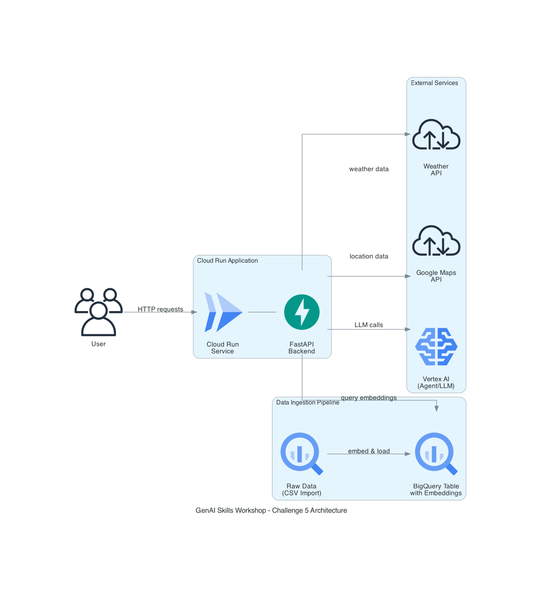

# Challenge 5: Alaska Department of Snow Online Agent

## Description

The Alaska Department of Snow (ADS) serves 750,000 people across
650,000 square miles and relies on interagency communication to
deliver services. During snow forecasts, regional offices face high call
volumes with questions about plowing, school closures, and other
disruptions. ADS is exploring an online agent or chatbot to offload
routine inquiries, but some administrators have reservations about cloud
services, and the CFO is concerned about costs.

## Goals

- Create a themed website that shows the forcast of the five most popular cities in Alaska
- Create a chat bot that can help answer some FAQs as well as give weather forcasts for towns in Alaska

## Requirements

- Backend data store for RAG
- Access to backend API functionality
- Unit tests for agent functionality
- Evaluation data using the Google Evaluation service API
- Prompt filtering and response validation implemented into the solution
- Log all prompts and responses
- Generative AI agent deployed to a website

## Utility Scripts

The `scripts/` directory contains helper scripts to set up the backend infrastructure:

- **`scripts/setup_bigquery.py`**:
  - Initializes the BigQuery dataset (`ads_data`) and the table (`faq_knowledge_base`).
  - Defines the schema, including fields for the FAQ content and vector embeddings.
  - **Usage**: `uv run scripts/setup_bigquery.py`

- **`scripts/load_faqs_to_bigquery.py`**:
  - Reads the FAQ data from `alaska-dept-of-snow/alaska-dept-of-snow-faqs.csv`.
  - Uses Vertex AI (`text-embedding-004`) to generate vector embeddings for each question/answer pair.
  - Uploads the structured data (text + embeddings) to the BigQuery table.
  - **Usage**: `uv run scripts/load_faqs_to_bigquery.py`

- **`scripts/evaluate_model.py`**:
  - Evaluates the chatbot using Vertex AI evaluation metrics (Groundedness, Verbosity, Instruction Following, Safety).
  - Tests responses against a set of FAQ questions and generates a detailed report.
  - **Usage**: `uv run scripts/evaluate_model.py`
  - **Documentation**: See `scripts/README_EVALUATION.md` for detailed instructions

## Testing

- **Unit Tests**: Run chatbot tests with `uv run pytest tests/test_chatbot.py -v`
  - See `tests/README.md` for detailed testing documentation
- **Model Evaluation**: Run evaluation metrics with `uv run scripts/evaluate_model.py`
  - See `scripts/README_EVALUATION.md` for evaluation documentation

## Application Architecture

The application follows a modern cloud-native architecture with the following components:



**Data Pipeline:**
- FAQ data is loaded from CSV and processed with Vertex AI embeddings
- Embeddings are stored in BigQuery for efficient similarity search

**Application Layer:**
- FastAPI backend deployed on Cloud Run for scalable serverless hosting
- Handles user requests and orchestrates service calls

**External Integrations:**
- **Weather API**: Provides real-time weather forecasts for Alaska cities
- **Google Maps API**: Geocoding and location services
- **Vertex AI Agent**: Powers the conversational AI chatbot with LLM capabilities

### Generating the Architecture Diagram

To regenerate the architecture diagram:

```bash
# Install Graphviz (required dependency)
# macOS:
brew install graphviz

# Ubuntu/Debian:
sudo apt-get install graphviz

# Windows:
# Download from https://graphviz.org/download/

# Install diagram generation tool
pip install diagrams

# Generate the diagram
python generate_diagram.py
```

## Code Quality

This project uses [Ruff](https://docs.astral.sh/ruff/) for linting and formatting:

```bash
# Check for issues
uv run ruff check .

# Auto-fix issues
uv run ruff check --fix .

# Format code
uv run ruff format .
```
